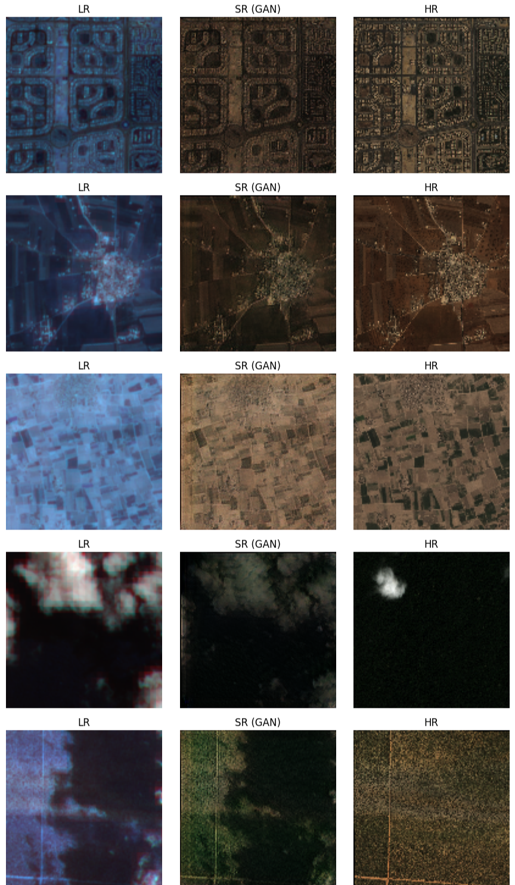
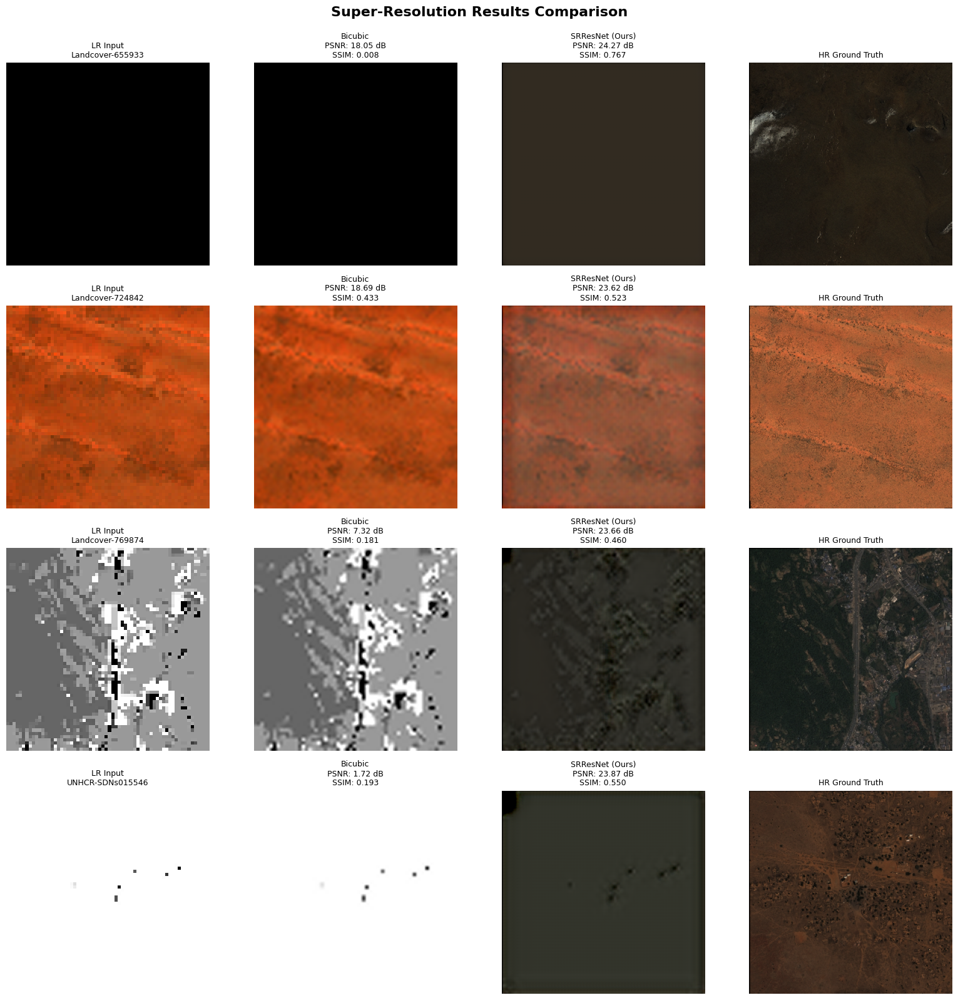
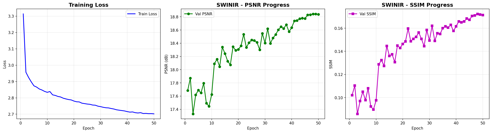

# Image Generation & Super-Resolution Models

## Overview

This repository contains a comparative implementation and analysis of three deep learning models for satellite image processing tasks:

- **Diffusion Model** (Transformer + GAN based)
- **Generative Adversarial Network (GAN)**
- **CNN / ResNet-based Model**

The objective is to evaluate these models based on performance, training efficiency, and output quality. Among all models, the **GAN model demonstrated the best overall performance**.

---

## Models Included

### 1. Diffusion Model

The diffusion model combines advanced techniques for high-quality image generation:

- Integrates **Diffusion (DDPM)**, **Transformer (SwinIR)**, and **GAN** architectures
- Produces high-quality, detailed outputs
- **Limitations**: Computationally expensive and slow to train

### 2. GAN Model (Best Performing)

A standard Generator-Discriminator architecture optimized for satellite imagery:

- Employs adversarial training for realistic image generation
- Demonstrates faster convergence and efficient training
- **Lower computational cost** compared to diffusion models

**Key Advantages:**
- Sharp and realistic outputs
- Faster training compared to diffusion approaches
- Simple yet effective architecture

### 3. CNN / ResNet Model

A convolutional neural network with residual connections:

- Utilizes deep residual learning for feature extraction
- Suitable for feature learning and classification tasks
- **Note**: Not specifically designed for image generation

---

## Visual Results

### Figure 1: GAN Model Performance


*Comparison of Low-Resolution (LR), High-Resolution (HR), and Super-Resolution (SR) outputs generated by the GAN model.*

### Figure 2: ResNet Model Comparison


*Visual comparison of ResNet model performance on satellite imagery.*

### Figure 3: Diffusion Model Results


*Output visualization from the SwinIR-based diffusion model.*

### Figure 4: ResNet Training Metrics


*Training and validation metrics for the ResNet model over multiple epochs.*

### Figure 5: Diffusion Model Training History


*Training progression and loss curves for the SwinIR diffusion model.*

### Figure 6: Dataset Samples


*Representative samples from the WorldStrat satellite imagery dataset.*

---


## Performance Comparison

| Model     | Image Generation | Training Speed | Output Quality | Overall Rating |
|-----------|------------------|----------------|----------------|----------------|
| Diffusion | Yes              | Slow           | High           | Medium         |
| **GAN**   | **Yes**          | **Fast**       | **Very High**  | **Best**       |
| ResNet    | No               | Fast           | Moderate       | Low            |

---

## Technology Stack

### Core Frameworks
- **Python** 3.x
- **PyTorch** / TensorFlow

### Deep Learning Libraries
- `torch` - PyTorch deep learning framework
- `torchvision` - Computer vision utilities
- `diffusers` - Diffusion model implementations
- `accelerate` - Distributed training optimization
- `transformers` - Transformer architecture implementations

### Geospatial & Data Processing
- `earthengine-api` - Google Earth Engine integration
- `rasterio` - Geospatial raster data processing
- `opencv-python` - Image processing operations

### Utilities
- `numpy` - Numerical computing
- `matplotlib` - Data visualization
- `tqdm` - Progress bar utilities

---

# Dataset

## Dataset Structure

The WorldStrat dataset comprises satellite imagery pairs for super-resolution tasks, organized into the following components:

### 1. Metadata CSV File

A comprehensive metadata table (`metadata.csv`) containing essential information for each image pair:

- Location identifiers and names
- Geographic coordinates (latitude and longitude)
- Resolution classifications (high-resolution vs. low-resolution)
- Land type classifications (urban, forest, water, etc.)
- Temporal metadata (date and time of capture)

This metadata serves as the primary index for navigating the dataset, enabling efficient matching of corresponding image pairs.

### 2. High-Resolution (HR) Image Folder

Contains sharp, detailed satellite images serving as ground truth data:

- **Spatial Resolution**: 1.5 meters per pixel
- **Source**: Airbus satellite imagery
- **Format**: GeoTIFF (`.tif`) files
- **Content**: Large patches of land at high detail
- **Example**: `location123_highres.tif`

These images provide the target outputs for super-resolution training.

### 3. Low-Resolution (LR) Image Folder

Contains lower-detail satellite images paired with high-resolution counterparts:

- **Spatial Resolution**: 10 meters per pixel
- **Source**: Sentinel-2 satellite imagery (publicly available)
- **Temporal Coverage**: Multiple images per location at different timestamps
- **Purpose**: Input data for multi-frame super-resolution

The temporal revisits enable advanced multi-frame super-resolution techniques.

### 4. Image Pair Structure

The dataset maintains structured relationships between image pairs:

- Each high-resolution image corresponds to **8 low-resolution images**
- Matching information provided in the metadata CSV
- Enables multi-frame super-resolution training approaches
- Supports temporal analysis and enhancement techniques

## How to Run Locally

Follow these steps to set up and run the project:

1. **Clone the repository**
   ```bash
   git clone <repository-url>
   cd worldStrat
   ```
2. **change directory to suitable model**
   ```bash
   cd GAN
   ```
   **OR**
   ```bash
   cd ResNet
   ```
   **OR**
   ```bash
   cd TransformerDiffusion
   ```

3. **Install dependencies**
   ```bash
   pip install -r requirements.txt
   ```

4. **Open the notebook**
   - Launch Jupyter Notebook or JupyterLab
   - Alternatively, open in Google Colab for cloud-based execution

5. **Execute the notebook**
   - Run cells sequentially from top to bottom
   - Monitor training progress and results
---

## Conclusion

This comparative study evaluated three distinct approaches to satellite image super-resolution. While diffusion models provide strong theoretical results and high-quality outputs, their substantial computational requirements limit practical deployment scenarios.

**Key Findings:**
- The **GAN model** achieved the optimal balance of quality, speed, and efficiency
- GAN training converges significantly faster than diffusion-based approaches
- The computational overhead of diffusion models restricts their practical applicability

**Recommendation:** For production deployment and real-world applications, the GAN model is the most effective solution, offering superior performance with manageable computational costs.

---

## Acknowledgments

This project utilizes the WorldStrat dataset for satellite imagery super-resolution research
